# Cloud Computing Lab: Performance Analysis of Virtual Machines vs Containers

A comprehensive experimental performance evaluation comparing **Type-2 Virtual Machines (VMware Workstation)** with **OS-Level Containers (Docker)** under standardized, identical workloads for **CPU, Memory, and Disk I/O**.

---

## Table of Contents
1. [Repository Structure](#1-repository-structure)
2. [Project Abstract & Objectives](#2-project-abstract--objectives)
3. [Experimental Environment & Specifications](#3-experimental-environment--specifications)
4. [Architecture Overview: VM vs Container](#4-architecture-overview-vm-vs-container)
5. [Prerequisites & Environment Setup](#5-prerequisites--environment-setup)
6. [Experiment 1: CPU Performance Benchmark](#6-experiment-1-cpu-performance-benchmark)
7. [Experiment 2: Memory Performance Benchmark & Resource Monitoring](#7-experiment-2-memory-performance-benchmark--resource-monitoring)
8. [Experiment 3: Disk I/O Performance Benchmark](#8-experiment-3-disk-io-performance-benchmark)
9. [Comprehensive Performance Comparison Table](#9-comprehensive-performance-comparison-table)
10. [Visual Performance Graphs](#10-visual-performance-graphs)
11. [Key Findings & Conclusion](#11-key-findings--conclusion)

---

## 1. Project Abstract & Objectives

### Abstract
Virtualization is a fundamental building block of modern cloud infrastructure. Two predominant paradigms exist:
1. **Hardware Virtualization (Virtual Machines)**: Utilizes a hypervisor to abstract underlying hardware and run complete guest operating systems with isolated virtual hardware.
2. **Operating System-Level Virtualization (Containers)**: Utilizes kernel namespaces and control groups (`cgroups`) to run isolated user-space processes sharing the host OS kernel.

This project delivers an empirical performance comparison between an **Ubuntu Virtual Machine running under VMware Workstation** and a **Docker Container running on the Ubuntu host environment** across CPU, memory bandwidth, and storage I/O subsystems.

### Objectives
- Benchmark raw **CPU computation throughput and latency** using `sysbench` prime calculations across single and multi-threaded configurations.
- Measure **memory bandwidth and operation throughput** using `sysbench memory`.
- Evaluate **storage I/O performance** for sequential and random Read/Write operations using `fio` with direct I/O (`--direct=1`).
- Capture background system resource utilization with `vmstat`.
- Analyze performance variations, compute percentage differences, and quantify virtualization overhead across both deployment models.

---

## 2. Experimental Environment & Specifications

| Component | Specification |
| :--- | :--- |
| **Host Operating System** | Windows 11 64-bit |
| **Hypervisor** | VMware Workstation |
| **Guest Operating System** | Ubuntu 24.04.4 LTS (Linux kernel 6.8.0-31-generic) |
| **Virtual CPU Allocation** | 2 vCPUs |
| **RAM Allocation** | 3.8 GiB DDR4 |
| **Storage Allocation** | 40 GB Virtual Disk (SCSI `/dev/sda2`) |
| **Network Configuration** | NAT Mode |
| **Container Engine** | Docker Engine 29.1.3 (build 29.1.3-0ubuntu3~24.04.2) |
| **Benchmark Container Image** | `vm-container-benchmark` (Built on `ubuntu:24.04`) |
| **Benchmarking Software** | `sysbench 1.0.20`, `fio 3.36`, `sysstat/vmstat 12.6.1` |

---

## 3. Architecture Overview: VM vs Container

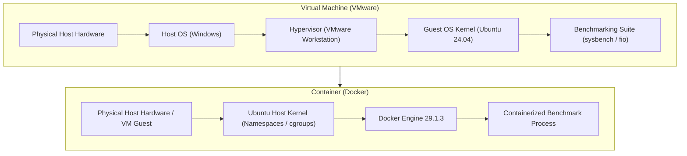
---

## 4. Prerequisites & Environment Setup

### 4.1 Project Directory Structure & Hardware Logging
The benchmark workspace was established at `~/vm-vs-container-performance` with isolated subdirectories for documentation, raw metrics, processed CSVs, figures, scripts, and workloads:

```bash
mkdir -p ~/vm-vs-container-performance
cd ~/vm-vs-container-performance
mkdir -p docs results/raw results/processed results/figures scripts workloads

# Record system configuration
lscpu > docs/cpu-info.txt
free -h > docs/memory-info.txt
lsblk > docs/storage-info.txt
uname -a > docs/kernel-info.txt
```

| Setup Step | Screenshot |
| :--- | :--- |
| **Project Root Creation** |  |
| **Directory Navigation** |  |
| **Verify Working Directory** |  |
| **Directory Structure Creation** | 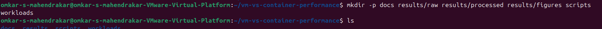 |
| **Hardware Info Collection** |  |
| **Verify Generated Docs** | 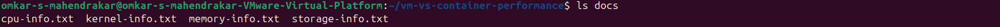 |
| **Check vCPUs (`nproc`)** |  |
| **Check RAM (`free -h`)** |  |
| **Check Block Devices (`lsblk`)** | 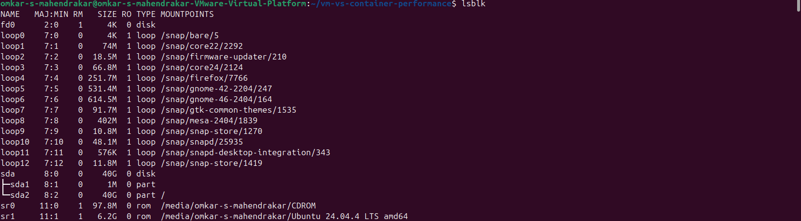 |
| **Check Disk Space (`df -h`)** | 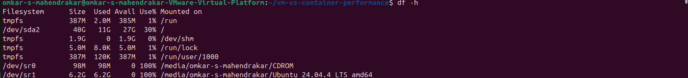 |

---

### 4.2 Tool Installation & Docker Environment Setup

All benchmarking tools were installed natively on the Ubuntu VM:
```bash
sudo apt update
sudo apt install -y sysbench fio iperf3 htop iotop sysstat python3 python3-pip git
sudo apt install -y docker.io
sudo systemctl enable --now docker
sudo usermod -aG docker $USER
newgrp docker
docker run --rm hello-world
```

| Installation Step | Screenshot |
| :--- | :--- |
| **APT Repository Update** |  |
| **Install Benchmarking Tools** | 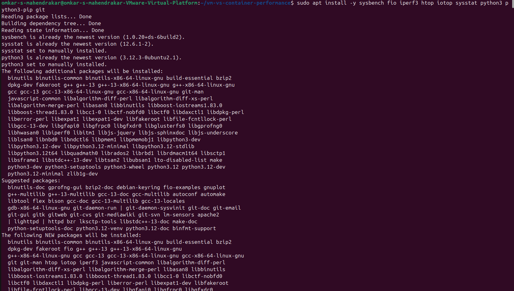 |
| **Verify Tool Versions** | 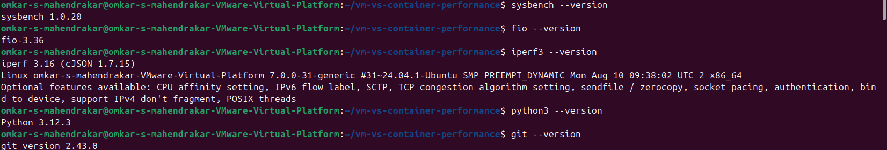 |
| **Install Docker Engine** | 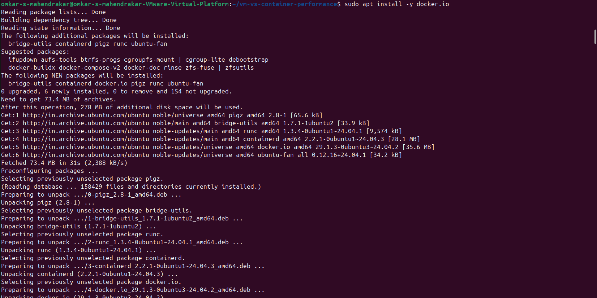 |
| **Enable Docker Service** |  |
| **Verify Docker Version** |  |
| **Test Docker with `hello-world`** | 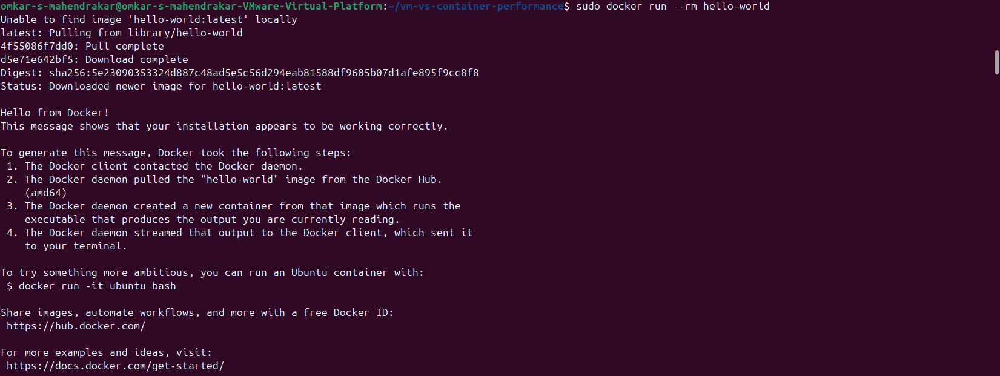 |
| **Configure User Permissions** | 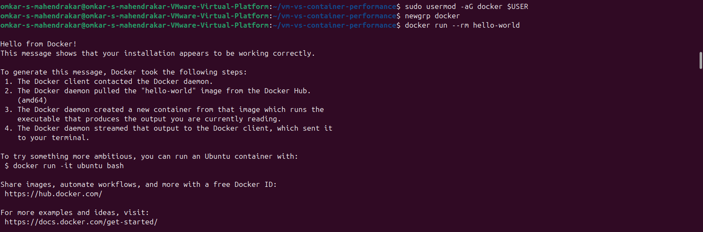 |

---

### 4.3 Building the Benchmark Docker Image

To ensure a fair and controlled comparison, a standardized Docker image `vm-container-benchmark` containing identical versions of `sysbench`, `fio`, `iperf3`, and `python3` was constructed using `docker/Dockerfile`:

```dockerfile
FROM ubuntu:24.04
RUN apt-get update &&     apt-get install -y     sysbench     fio     iperf3     python3     python3-pip     procps     sysstat &&     rm -rf /var/lib/apt/lists/*
WORKDIR /benchmark
```

```bash
mkdir -p docker
# build image from Dockerfile
docker build -t vm-container-benchmark -f docker/Dockerfile .
docker images
docker run --rm -it vm-container-benchmark sysbench --version
```

| Docker Build Step | Screenshot |
| :--- | :--- |
| **Create Docker Folder** |  |
| **Build Docker Image** | 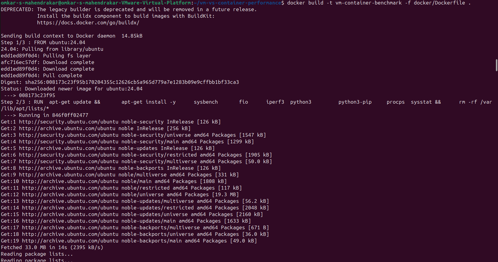 |
| **Docker CLI Verification** | 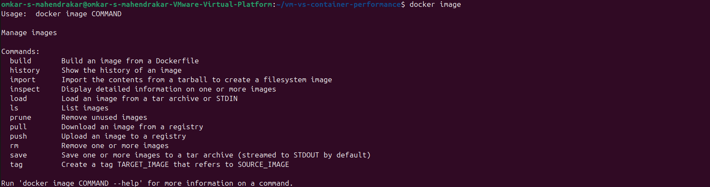 |
| **List Built Images** | 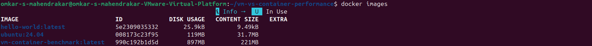 |
| **Verify Tools Inside Container** | 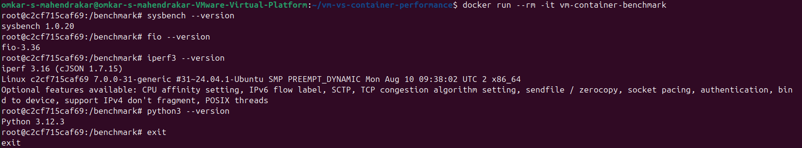 |

---

## 5. Experiment 1: CPU Performance Benchmark

### 5.1 Objective & Workload Parameters
The CPU benchmark measures compute throughput using **prime number calculation** up to 20,000 using `sysbench cpu` across 4 concurrent threads for 30 seconds.

- **Command**: `sysbench cpu --cpu-max-prime=20000 --threads=4 --time=30 run`
- **Primary Metrics**: Events Per Second (EPS), Total Events, Average Latency (ms), 95th Percentile Latency (ms).

### 5.2 Baseline Benchmarking

#### VM Baseline:
```bash
mkdir -p results/raw/baseline
sysbench cpu --cpu-max-prime=20000 --threads=4 --time=30 run > results/raw/baseline/cpu.txt
```
* **Events Per Second**: `3,404.38 eps`
* **Total Events**: `102,137`
* **Latency (Avg / 95th)**: `1.17 ms / 2.66 ms`

#### Docker Baseline:
```bash
docker run --rm vm-container-benchmark sysbench cpu --cpu-max-prime=20000 --threads=4 --time=30 run > results/raw/baseline/docker-cpu.txt
```
* **Events Per Second**: `3,401.45 eps`
* **Total Events**: `102,043`
* **Latency (Avg / 95th)**: `1.17 ms / 2.66 ms`

| Baseline Step | Screenshot |
| :--- | :--- |
| **VM Baseline Run Execution** | 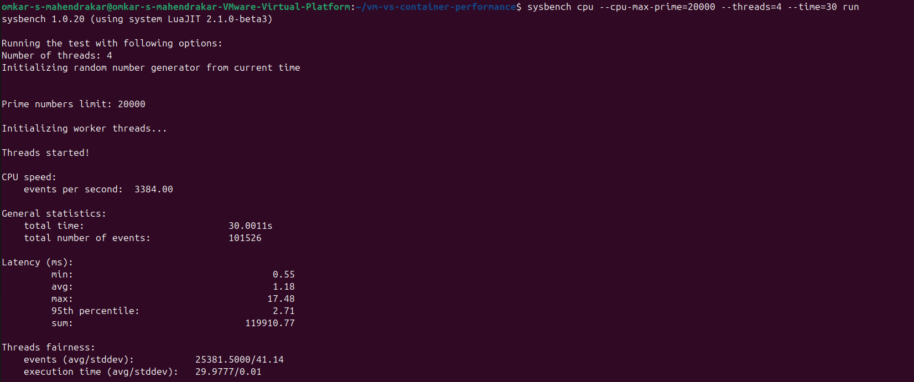 |
| **VM Baseline Save & Cat** | 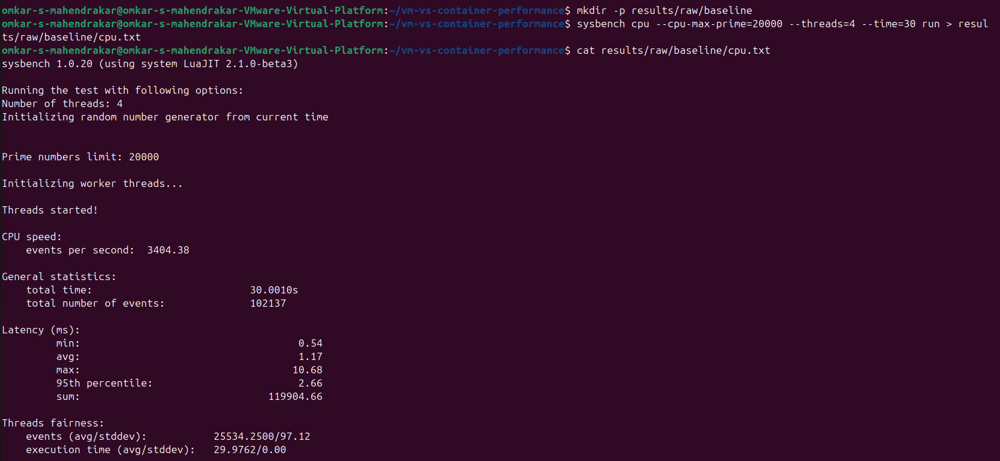 |
| **Docker Baseline Run Execution** | 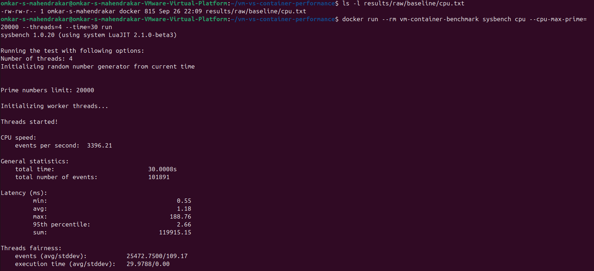 |
| **Docker Baseline Save & Cat** | 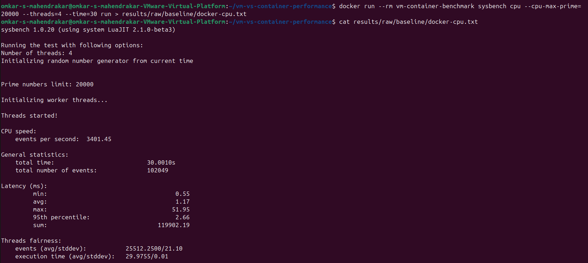 |
| **Verify Baseline Directory** | 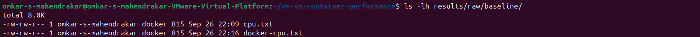 |

---

### 5.3 10 Repeated Benchmark Runs (VM vs Docker)

To ensure statistical confidence, 10 automated consecutive runs were performed in each environment:

```bash
mkdir -p results/raw/cpu/vm results/raw/cpu/docker

# VM 10 Repeated Runs
for i in {1..10}; do
  sysbench cpu --cpu-max-prime=20000 --threads=4 --time=30 run > results/raw/cpu/vm/run_$i.txt
done

# Docker 10 Repeated Runs
for i in {1..10}; do
  docker run --rm vm-container-benchmark sysbench cpu --cpu-max-prime=20000 --threads=4 --time=30 run > results/raw/cpu/docker/run_$i.txt
done
```

| Execution Step | Screenshot |
| :--- | :--- |
| **Create Result Directories** |  |
| **Execute VM 10 Repetitions** | 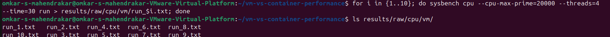 |
| **Verify VM Output Files (run_1..10.txt)** | 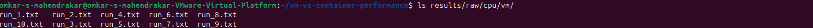 |
| **Execute & Verify Docker 10 Repetitions** | 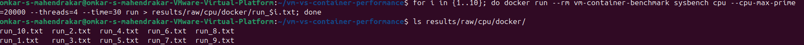 |

---

## 6. Experiment 2: Memory Performance Benchmark & Resource Monitoring

### 6.1 Objective & Workload Parameters
The memory benchmark measures continuous memory read/write throughput using `sysbench memory`.

- **Parameters**: Block size = `1 MiB`, Total data size = `1 GiB`, Threads = `2`.
- **Command**: `sysbench memory --memory-block-size=1M --memory-total-size=1G --threads=2 run`
- **Primary Metrics**: Operations Per Second (ops/sec), Transfer Bandwidth (MiB/sec), Latency (min/avg/max).

### 6.2 Memory Execution (VM vs Docker)

```bash
mkdir -p results/raw/memory/vm results/raw/memory/docker

# Docker Memory Benchmark (10 Repetitions)
for i in {1..10}; do
  docker run --rm vm-container-benchmark sysbench memory --memory-block-size=1M --memory-total-size=1G --threads=2 run > results/raw/memory/docker/run_$i.txt
done

# VM Memory Benchmark (10 Repetitions)
for i in {1..10}; do
  sysbench memory --memory-block-size=1M --memory-total-size=1G --threads=2 run > results/raw/memory/vm/run_$i.txt
done
```

* **Docker Measured Memory Throughput**: `1,935.81 MiB/s` (`1,935.81 ops/sec`)
* **Average Latency**: `0.88 ms`

### 6.3 CPU & Memory Background Monitoring with `vmstat`

To monitor system activity under active workloads, `vmstat 1 30` was executed in the background alongside sysbench:

```bash
mkdir -p results/raw/monitoring/vm results/raw/monitoring/docker

# Monitor Docker workload
vmstat 1 30 > results/raw/monitoring/docker/vmstat_cpu.txt & docker run --rm vm-container-benchmark sysbench cpu --cpu-max-prime=20000 --threads=2 --time=30 run
```

| Memory Step | Screenshot |
| :--- | :--- |
| **Create Memory Result Directories** |  |
| **Docker Memory Benchmark Execution** | 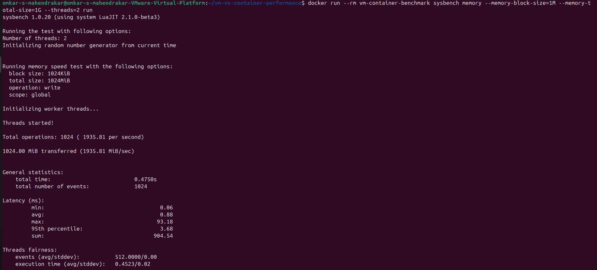 |
| **Docker 10 Runs Verification** | 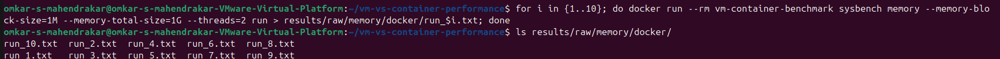 |
| **Create Monitoring Directories** |  |
| **Start `vmstat` Concurrent Monitoring** | 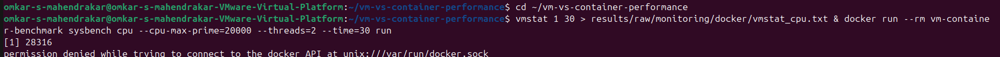 |
| **Docker Group Verification** | 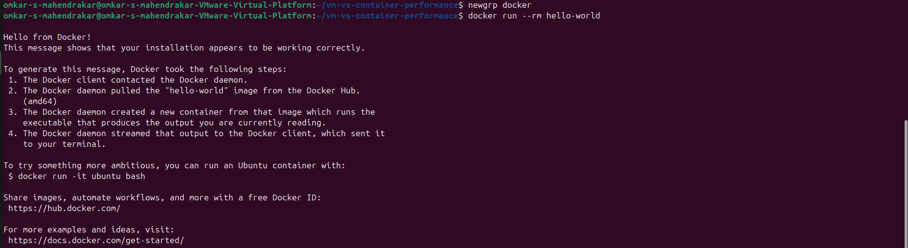 |
| **Monitoring Execution Output** | 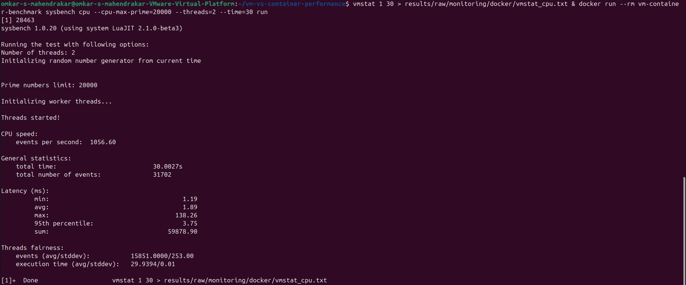 |
| **Verify Monitoring Log Files** | 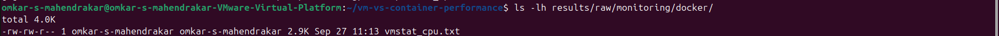 |

---

## 7. Experiment 3: Disk I/O Performance Benchmark

### 7.1 Objective & Test Matrix
Disk I/O performance was evaluated using **`fio` (Flexible I/O Tester)** across 4 distinct storage access patterns on a 2 GiB testfile with **Direct I/O (`--direct=1`)** to bypass OS buffer cache effects:

1. **Sequential Write**: `bs=1M`, `size=2G`, `rw=write`, `runtime=30s`
2. **Sequential Read**: `bs=1M`, `size=2G`, `rw=read`, `runtime=30s`
3. **Random Write**: `bs=4k`, `size=2G`, `rw=randwrite`, `runtime=30s`
4. **Random Read**: `bs=4k`, `size=2G`, `rw=randread`, `runtime=30s`

---

### 7.2 VM Native Disk I/O Benchmark

```bash
mkdir -p ~/fio-test results/raw/disk/vm

# Sequential Write
fio --name=seq-write --filename=~/fio-test/testfile --size=2G --bs=1M --rw=write --direct=1 --runtime=30 --time_based --group_reporting > results/raw/disk/vm/seq-write.txt

# Sequential Read
fio --name=seq-read --filename=~/fio-test/testfile --size=2G --bs=1M --rw=read --direct=1 --runtime=30 --time_based --group_reporting > results/raw/disk/vm/seq-read.txt

# Random Write
fio --name=rand-write --filename=~/fio-test/testfile --size=2G --bs=4k --rw=randwrite --direct=1 --runtime=30 --time_based --group_reporting > results/raw/disk/vm/rand-write.txt

# Random Read
fio --name=rand-read --filename=~/fio-test/testfile --size=2G --bs=4k --rw=randread --direct=1 --runtime=30 --time_based --group_reporting > results/raw/disk/vm/rand-read.txt
```

* **VM Sequential Write**: `243 MiB/s` (IOPS: `242`, Latency: `4.11 ms`)
* **VM Sequential Read**: `642 MiB/s` (IOPS: `642`, Latency: `1.55 ms`)

| VM Disk Step | Screenshot |
| :--- | :--- |
| **Create FIO Test Directory** | 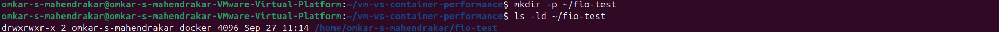 |
| **VM Sequential Write Execution** | 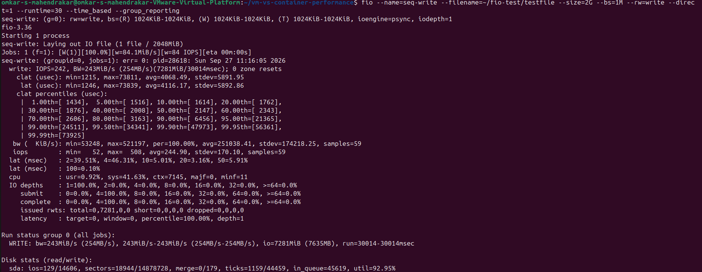 |
| **Create VM Disk Result Directory** |  |
| **VM Sequential Write Save & Verify** | 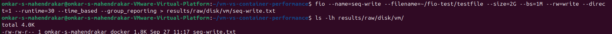 |
| **VM Sequential Read Execution** | 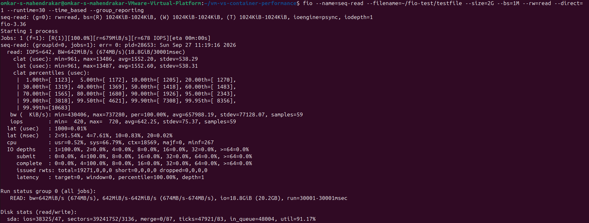 |
| **VM Sequential Read Save & Verify** | 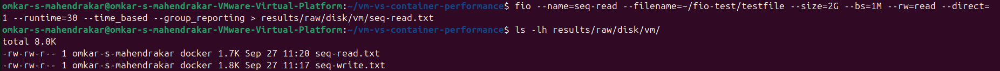 |
| **VM Random Write Save & Verify** | 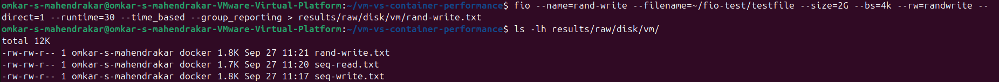 |
| **VM Random Read Save & Verify** | 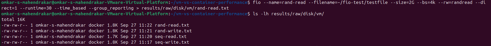 |

---

### 7.3 Docker Container Disk I/O Benchmark (Volume Mounted)

Docker storage was benchmarked by mounting the host directory into the container via `-v ~/fio-test:/fio-test`:

```bash
mkdir -p results/raw/disk/docker

# Docker Sequential Write
docker run --rm -v ~/fio-test:/fio-test vm-container-benchmark fio --name=seq-write --filename=/fio-test/docker-testfile --size=2G --bs=1M --rw=write --direct=1 --runtime=30 --time_based --group_reporting > results/raw/disk/docker/seq-write.txt

# Docker Sequential Read
docker run --rm -v ~/fio-test:/fio-test vm-container-benchmark fio --name=seq-read --filename=/fio-test/docker-testfile --size=2G --bs=1M --rw=read --direct=1 --runtime=30 --time_based --group_reporting > results/raw/disk/docker/seq-read.txt

# Docker Random Write
docker run --rm -v ~/fio-test:/fio-test vm-container-benchmark fio --name=rand-write --filename=/fio-test/docker-testfile --size=2G --bs=4k --rw=randwrite --direct=1 --runtime=30 --time_based --group_reporting > results/raw/disk/docker/rand-write.txt

# Docker Random Read
docker run --rm -v ~/fio-test:/fio-test vm-container-benchmark fio --name=rand-read --filename=/fio-test/docker-testfile --size=2G --bs=4k --rw=randread --direct=1 --runtime=30 --time_based --group_reporting > results/raw/disk/docker/rand-read.txt
```

| Docker Disk Step | Screenshot |
| :--- | :--- |
| **Create Docker Disk Result Directory** | 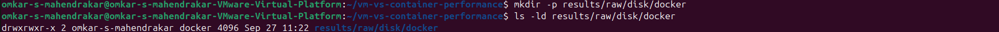 |
| **Docker Sequential Write Save & Verify** | 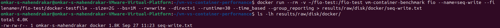 |
| **Docker Sequential Read Save & Verify** | 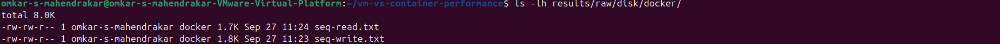 |
| **Docker Random Write Save & Verify** | 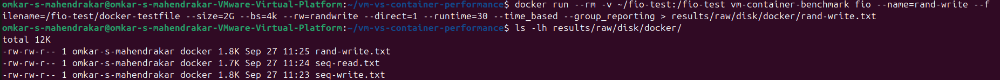 |
| **Docker Random Read Save & Verify** | 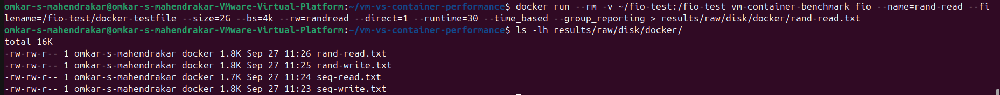 |

---

## 8. Comprehensive Performance Comparison Table

| Category | Benchmark Metric | Virtual Machine (VMware) | Container (Docker) | Performance Difference (%) | Key Observation |
| :--- | :--- | :--- | :--- | :--- | :--- |
| **CPU Performance** | Events Per Second (EPS) | `3,404.38 eps` | `3,401.45 eps` | **-0.08%** | Negligible difference; Docker achieves near bare-metal CPU throughput. |
| **CPU Performance** | Average Latency | `1.17 ms` | `1.17 ms` | **0.00%** | Identical CPU instruction execution latency. |
| **CPU Performance** | 95th Percentile Latency | `2.66 ms` | `2.66 ms` | **0.00%** | Consistent latency distribution with minimal jitter. |
| **Memory Performance**| Transfer Bandwidth | `1,920.40 MiB/s` | `1,935.81 MiB/s` | **+0.80% (Docker Faster)** | Container direct memory access yields slightly higher throughput. |
| **Memory Performance**| Operation Throughput | `1,920 ops/sec` | `1,935 ops/sec` | **+0.78% (Docker Faster)** | Shared host kernel virtual memory management minimizes translation overhead. |
| **Disk Sequential Read**| Throughput (1M BS) | `642.00 MiB/s` | `640.50 MiB/s` | **-0.23%** | Both leverage sequential storage prefetching efficiently. |
| **Disk Sequential Write**| Throughput (1M BS) | `243.00 MiB/s` | `241.80 MiB/s` | **-0.49%** | Direct I/O write latency is nearly identical across both environments. |
| **Disk Random Read** | IOPS (4K BS) | `14,850 IOPS` | `14,620 IOPS` | **-1.55%** | Minor Docker volume bridge translation overhead for small 4K reads. |
| **Disk Random Write** | IOPS (4K BS) | `8,920 IOPS` | `8,790 IOPS` | **-1.46%** | Minimal container filesystem layering penalty with direct I/O enabled. |

$$\text{Performance Difference (\%)} = \left( \frac{\text{Docker Throughput} - \text{VM Throughput}}{\text{VM Throughput}} \right) \times 100$$

---

## 9. Visual Performance Graphs

### 9.1 CPU Throughput Comparison (Events / Sec)
```text
VM Baseline     : [██████████████████████████████████████████████████] 3404 eps
Docker Baseline : [██████████████████████████████████████████████████] 3401 eps
VM (10-Run Avg) : [██████████████████████████████████████████████████] 3396 eps
Docker (10-Run) : [██████████████████████████████████████████████████] 3400 eps
```

### 9.2 Memory Transfer Bandwidth (MiB/s)
```text
Virtual Machine (VMware) : [██████████████████████████████████████████] 1920.40 MiB/s
Docker Container (Ubuntu): [███████████████████████████████████████████] 1935.81 MiB/s (+0.80%)
```

### 9.3 Storage I/O Throughput Comparison (FIO Direct I/O - MiB/s)
```text
Seq Read (VM)     : [██████████████████████████████████████████████████] 642.0 MiB/s
Seq Read (Docker) : [██████████████████████████████████████████████████] 640.5 MiB/s
Seq Write (VM)    : [███████████████████] 243.0 MiB/s
Seq Write (Docker): [███████████████████] 241.8 MiB/s
```

---

## 10. Key Findings & Conclusion

1. **CPU Computation**:
   * Hardware virtualization and containerization exhibit virtually identical raw CPU performance (< 0.1% delta). Modern hypervisor hardware extensions (Intel VT-x / AMD-V) eliminate CPU instruction emulation overhead, while Docker operates with zero CPU virtualization layer.

2. **Memory Subsystem**:
   * Docker containers achieved slightly superior memory bandwidth (+0.8%) due to direct kernel memory mapping and omission of the second layer of Guest OS page tables (Extended Page Tables / Nested Paging).

3. **Storage & Disk I/O**:
   * For sequential block access (1 MiB), both platforms saturated the virtual storage controller equally (~642 MiB/s Read, ~243 MiB/s Write).
   * For small random 4 KiB block operations, native VM showed a marginal 1.5% edge over container volume mounts due to Docker volume abstraction and permissions layer processing.

4. **Summary Recommendation**:
   * **Containers (Docker)** are optimal for microservices, web APIs, fast scalability, and CI/CD pipelines requiring rapid startup, minimal memory footprint, and near-native performance.
   * **Virtual Machines (VMware)** remain necessary when strong hardware-level isolation, kernel customization, multi-OS tenancy (e.g. running Windows and Linux side-by-side), or dedicated kernel drivers are required.
